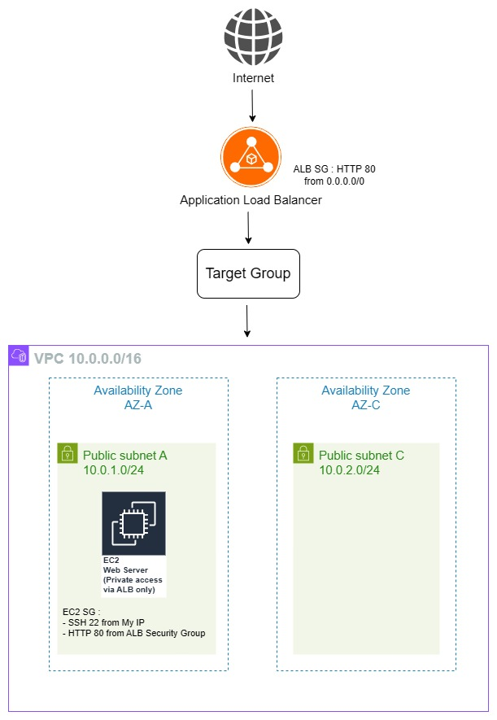
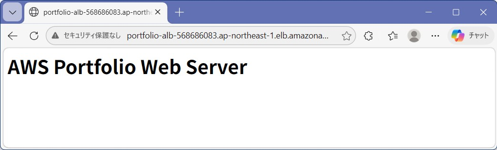
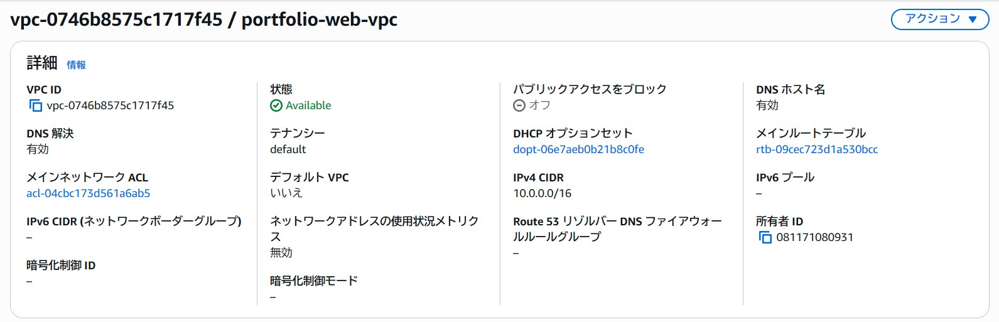
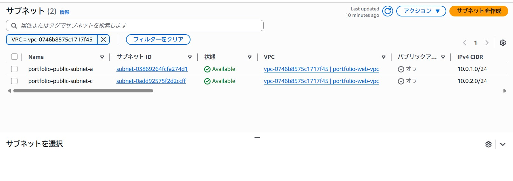
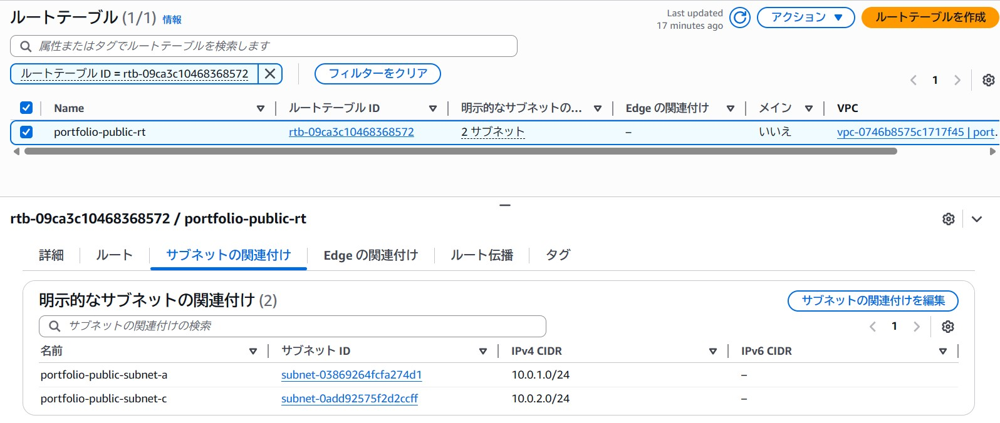
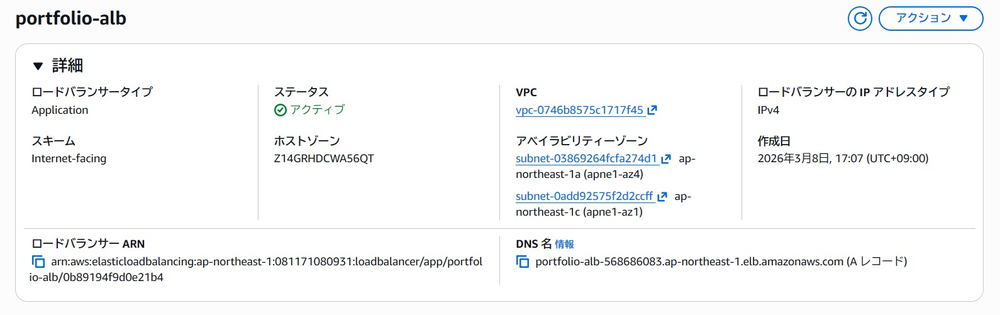
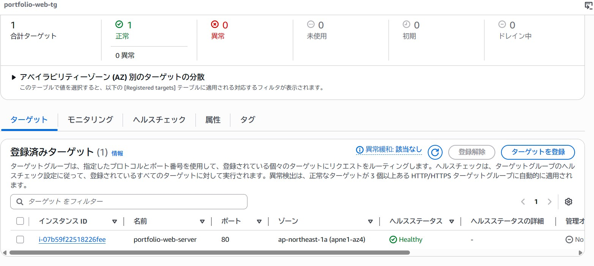

# AWS Web Server Architecture Portfolio

## Architecture

## 概要

AWSの基本的なWebアーキテクチャの理解を目的として構築しました。

AWS上にWebサーバー環境を構築し、Application Load Balancer (ALB) を利用してEC2インスタンスへトラフィックをルーティングする構成としています。

ネットワークはVPC内に2つのAvailability Zoneを配置し、それぞれにPublic Subnetを作成しています。

セキュリティ設計として、EC2インスタンスへのHTTPアクセスはALBのSecurity Groupからのみ許可し、インターネットからの直接アクセスを制限しています。

※管理用SSHアクセスは許可しています。
---

## 使用サービス

- Amazon VPC
- Subnet
- Internet Gateway
- Route Table (Public)
- Security Group
- Amazon EC2
- Apache HTTP Server
- Application Load Balancer
- Target Group

---

## ネットワーク構成

### VPC

CIDR

10.0.0.0/16

---

### Public Subnet

10.0.1.0/24
10.0.2.0/24

2つのAZにSubnetを配置

---

### Route Table

0.0.0.0/0 -> Internet Gateway

インターネットアクセス用ルーティングを設定

---

## EC2 Web Server

### インスタンス

- Amazon Linux 2023
- t3.micro

---

### Apacheインストール

- sudo dnf install httpd -y
- sudo systemctl start httpd
- sudo systemctl enable httpd

---

### テストページ

AWS Portfolio Web Server

---

## Application Load Balancer

Scheme

Internet-facing

Listener

HTTP : 80

---

## Target Group

Name
portfolio-web-tg

Protocol
HTTP

Port
80

Target type
Instance

---

### Health Check

Protocol : HTTP
Path : /

EC2インスタンスが **Healthy** 状態であることを確認

---

## セキュリティ設計

### ALB Security Group

HTTP 80
Source : 0.0.0.0/0

---

### EC2 Security Group

SSH 22
Source : 0.0.0.0/0

HTTP 80
Source : ALB Security Group

これにより

Internet -> ALB -> EC2

の通信のみ許可し、EC2への直接アクセスを防止しています。

---

## 動作確認

ALB DNSへアクセス

http://portfolio-alb-568686083.ap-northeast-1.elb.amazonaws.com

表示

AWS Portfolio Web Server

---

## 検証

EC2へ直接アクセス

http://13.112.40.103

結果

アクセス不可

ALB経由のみ通信可能な構成となっています。

---

# スクリーンショット

### Webアクセス（ALB経由）

---

### VPC

---

### Subnet

---

### Route Table

---

### Application Load Balancer

---

### Target Group

---

# 学習ポイント

今回の構築を通して以下を理解しました。

- VPCを用いたAWSネットワーク設計
- SubnetとRoute Tableの関係
- Internet Gatewayによるインターネット接続
- Application Load Balancerによるトラフィック分散
- Target GroupによるEC2へのルーティング
- ヘルスチェックによるサーバー状態監視
- Security Groupを用いたアクセス制御

---

# 今後の改善

- Auto Scalingの導入による可用性向上
- HTTPS化（ACM + ALB）
- TerraformによるInfrastructure as Code化

